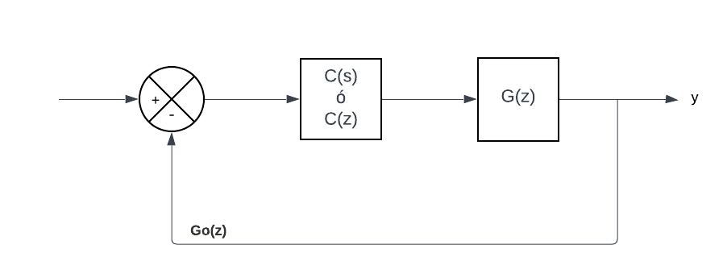

# Metodo algebraico
Consisten en plantear ecuaciones algebraicas para asi poder obtener el comportamiento de un sistema el cual puede sea en el tiempo continuo o discreto como se ve en la siguiente figura

$$Figura 1: Figura Sistema$$

## Metodo por igualacion de modelo
Para poder realizar este metodo hay que tener en cuenta los siguientes aspectos: Conocer la funcion en lazo abierto G(Z) y el comportamiento del sistema en lazo cerrado Go(z), mediante lo cual obtenemos la siguiente ecuacion que corresponde a la funcion del controlador C(z) para el correpondiente comportamiento.

$$C\left( Z \right)=\frac{Go\left( Z \right)}{G\left( Z \right) -Go\left( Z \right)*G\left( Z \right)}=\frac{Go\left( Z \right)}{G\left( Z \right)(1-Go\left( Z \right))}$$

*Hay que tener en cuenta que este metodo solo sirve para funciones causales o estrictamente propias por lo contrario se generaria un controlador no realizable

## Ejemplos 

💡**Ejemplo 1:**  Diseñar un controlador que tiene las siguientes funciones para G(Z) y Go(Z)

$$G\left( Z \right)=\frac{0,58}{Z^{2}-12,4Z+0,25} $$ 

$$Go\left( Z \right)=\frac{0,21Z+2}{Z^{2}-32,8Z+3,2}$$

Remplazamoss C(Z) haciendo uso del metodo expliado anteriormente para obtener el controlador

$$C\left( Z \right)=\frac{\frac{0,21Z+2}{Z^{2}-32,8Z+3,2}}{\frac{0,58}{Z^{2}-12,4Z+0,25}(1 - \frac{0,21Z+2}{Z^{2}-32,8Z+3,2})}$$

$$C\left( Z \right)=\frac{\frac{0,21Z+2}{Z^{2}-32,8Z+3,2}}{\frac{0,58}{Z^{2}-12,4Z+0,25}*\frac{Z^{2}-32,8Z+3,2-0,21Z+2}{Z^{2}-32,8Z+3,2}}$$

$$C\left( Z \right)=\frac{0,21Z+2}{\frac{0,58(Z^{2}-33,01Z+5)}{Z^{2}-12,4Z+0,25}}$$

$$C\left( Z \right)=\frac{0,21Z^{3}-0,604Z^{2}-24,74Z+0,5}{0,58Z^{2}-19,15Z+2,9}$$

💡**Ejemplo 2:** Construir un controlador que cumpla con los siguientes requisitos: Estabilidad, una factor de amortiguamiento de 0,2 y una frecuencia natural de 4 rad/s, teniendo en cuenta un valor de T=2 y G(Z)

$$G\left( Z \right)=\frac{Z+5}{Z^{2}+3,5Z+1}$$

Tomando en cuenta los datos de referencia se halla la funcion de segundo orden en tiempo continuo para despues convertirla a tiempo discreto:

$$Go\left( s \right)=\frac{16}{s^{2}+1,6s+16}$$

$$Go\left( Z \right)=\frac{16}{0,25Z^{2}+0,3Z+15,45}$$

Con esto ya se remplaza en la ecuacion del metodo y se obtiene la funcion del controlador deseado

$$C\left( Z \right)=\frac{\frac{16}{0,25Z^{2}+0,3s+15,45}}{\frac{Z+5}{Z^{2}+3,5Z+1}(1-\frac{16}{0,25Z^{2}+0,3Z+15,45})}$$

$$C\left( Z \right)=\frac{\frac{16}{0,25Z^{2}+0,3s+15,45}}{\frac{Z+5}{Z^{2}+3,5Z+1}*\frac{0,25Z^{2}+0,3Z+15,45-16}{0,25Z^{2}+0,3Z+15,45}}$$

$$C\left( Z \right)=\frac{(16)Z^{2}+3,5Z+1}{(Z+5)0,25Z^{2}+0,3s-1,45}$$
