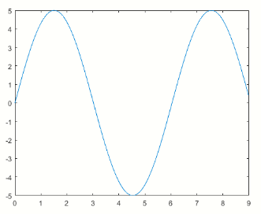
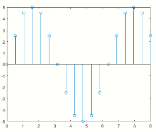

# Transformada Z de adelantos y atrasos
## Muestreo en términos matemáticos:
* Si se tiene una función 𝑓(𝑡) continua y se quiere expresar <br> matemáticamente el equivalente discreto:<br>
   $$𝑦(𝑡)= 5𝑆𝑒𝑛(1.04𝑡)$$<br>
```
%% codigo de matlab
t=0:(pi/100):9;
y= 5*sin(1.04*t);
plot(t,y)
```
$$T=0.5 seg$$


