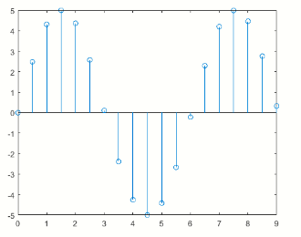
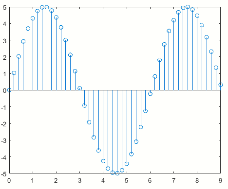

# Transformada Z de adelantos y atrasos
## 1. Muestreo en términos matemáticos:
* Si se tiene una función 𝑓(𝑡) continua y se quiere expresar <br> matemáticamente el equivalente discreto:<br>
$$𝑦(𝑡)= 5𝑆𝑒𝑛(1.04𝑡)$$<br>
<br>
**Figura 1**<br>
$$T=0.5 seg$$<br>
<br>
**Figura 2**

```
%% codigo de matlab Figura 1
t=0:(pi/100):9;
y= 5*sin(1.04*t);
plot(t,y)
%% codigo de matlab Figura 2
T=0:0.5:9;
y1= 5*sin(1.04*T);
stem(T,y1)
```
## 2. Función en términos de muestras
$$𝑓(𝑡)= 𝑓(𝑘𝑇)$$<br>
* T es el periodo de muestreo<br>
$$𝑦(𝑘𝑇) = 5𝑆𝑒𝑛 1,04𝑘𝑇 ; 𝑇 = 0.5 𝑠𝑒𝑔$$<br>
<br>
$$𝑦(𝑘𝑇) = 5𝑆𝑒𝑛 1,04𝑘𝑇 ; 𝑇 = 0.2 𝑠𝑒g$$<br>
<br>
**Figura 3**
```
T=0:0.2:9;
y1= 5*sin(1.04*T);
stem(T,y1)
```
# Representación matemática de los sistemas
## 1. Ecuación en diferencias
$$𝑏_𝑛𝑢(𝑘) + 𝑏_{𝑛-1}𝑢(𝑘−1)+ ⋯ + 𝑏_0𝑢(𝑘−𝑛) = 𝑦(𝑘)+𝑎_{𝑛−1}𝑦(𝑘 − 1)+ ⋯ + 𝑎_0𝑦(𝑘 − 𝑛)$$
* Donde “u” es la entrada y “y” es la salida
* La dinámica del sistema se representa a través de una combinación lineal de diferentes muestras de las señales
* Al igual que con las ecuaciones diferenciales, las ecuaciones en diferencias representan el comportamiento dinámico de un sistema en términos de sus señales de entrada y salida
## 2. Características ecuaciones en diferencias
* Las ecuaciones en diferencias pueden ser homogeneas, lineales, invariantes en el tiempo
  💡**Ejemplo 1:**
* $$𝑦(𝑘+3) + 0.08𝑦(𝑘+2) + 0.09𝑦(𝑘)𝑢(𝑘)= 0$$
  *  Lineal, invariante en el tiempo, no homogénea
  💡**Ejemplo 2:**
* $$𝑦(𝑘+2)+𝑠𝑒𝑛(0,7𝑘)𝑦(𝑘+3)+0,6𝑦(𝑘) = 0$$ 
  *  Lineal, variante en el tiempo, homogénea
  💡**Ejemplo 3:**
* $$𝑦(𝑘+1) = −0,04(𝑦(𝑘))^2$$
  *  No lineal, invariante en el tiempo, homogénea
## 3. Solución de ecuaciones en diferencias
* Las ecuaciones en diferencias se solucionan por dos enfoques fundamentales:
 * Métodos iterativos
   >🔑 *Definición:* Un método iterativo es un método que progresivamente va calculando aproximaciones a la solución de un problema
 * Transformada Z
   >🔑 *Definición:* Es una herramienta matemática que nos permite convertir una señal de tiempo discreto, que es una secuencia de números reales o complejos, en una representación compleja en el dominio de la frecuencia.
## 4. Solución por métodos iterativos
💡**Ejemplo 1:**<br>
$$𝑦(𝑘)=\frac{1}{4}(−3y(k−2)+y(k−3)+4u(k−5)−6u(k−8))$$
* Condiciones iniciales:<br>
  $$𝑦(−2) = 1; 𝑦(−1)= −2 ; 𝑢(𝑘)1 ;𝑘 = 0,1,2, … \\ 0; 𝑘 < 0$$<br>
# Transformada Z
## 1. Relación Z y L
## 2. Solución de ecuaciones en diferencias por transformada Z
## 3. Transfomadas Z importantes en control
## 4. Atrasos
## 5. Transformada Z de un atraso
## 6. Adelantos
## 7. Transformada Z de un adelanto
# Función de transferencia discreta
## Funciones de transferencia en el dominio Z
## Función de transferencia pulso


