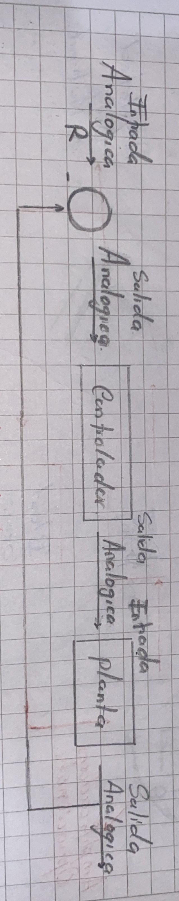
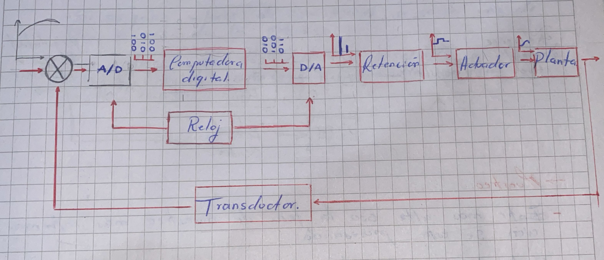
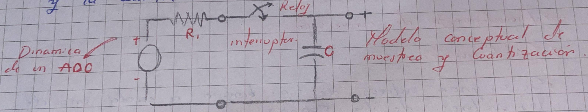
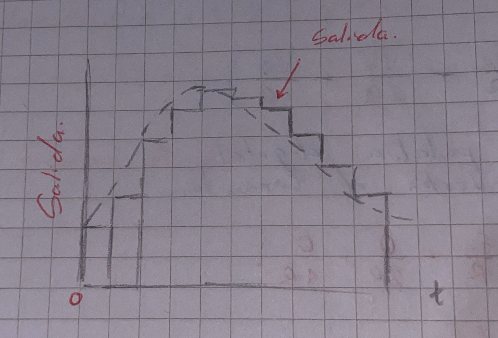

# Control Digital

## Señales Digitales VS Señales Analogicas 
  La principal diferencia entre ambas es que la señales analogicas o continuas puede tomar cualquier valor en el dominio del tiempo, mientras que las digitales solo poseen dos valores por estado.

### ¿Porque control digital?

* EXACTITUD:  
  Capacidad del sistema del control para hacer que la salida se ajuste con presicion al valor deseado, con respecto al control analogo la exactitud del control digital es menor. 
  
* ERRORES DE IMPLEMENTACION : Son errores que pueden afectar la presiion y el rendimiento del sistema, como podran ser el montaje y el programa. 

* FEXIBILIDAD : Capacidad del sistema de contro para adaptarse a diferentes condiciones, requisitos y cambios.  

* VELOCIDAD : Rapidez con la que se ejecuta para procesar señales y realizar calculos para ajustar la salida en respuestas a las variaciones del sistema.  

* COSTOS : Estandarizar los costos en base al sofware.   

  ###  Estructura del controlador analogico  
  

## Estructura del controlador analogico  

  

## MUESTREO  
* Entre mas alta sea la tasa de muestre mass informacion se esta procesando
* Si la tasa es muy baja se pierde mucha informacion y no se puede recostruir fielmente la señal.
* El muestreo puede ser periodico (unico), de tasa multiple o aleatorio.

  ## Procedimiento de conversion

  ### Cuantizacion:  
  La señal analoga se convierte en una serie  de valores que corresponden a cada una de las medidas tomadas en el muestreo.
  ### Codificacion:  
 * Se asignan valores de tipo binario a cada uno de los valores de la cuantizacion.
 * Los valores los define el diseñador de acuerdo con el tipo de informacion en la actualizacion.
 * Lo mas usual es que se utiliuce codfo binario para representar cada valor de voltaje.
 * En la codificacion es importante definir el numero de bits que utilizara el codigo ya que al usar demasiados bits se desperdicia memoria y procesamiento en el 
   dispositivo que esta procesand.

   ## Consideraciones practicas
Los conversores A/D comerciales estan limitados a convertir un rango de voltajes determinados. 
para algunas aplicaciones es necesario tener en cuenta los tiempos de retraso entre el muestreo y la cuanatizacion del valor.

  

## Tiempos de muestreador  
### TA (Tiempo de adquisicion): 
Tiempo que trascurre desde que se da la orden de muestreo hasta que se retire dentro de cierto margen de tolerancia.  

## TP (Tiempo de apertura):
Tiempo que trascurre desde que se inicia la retencion hasta que abre el muestrador.

## TS (Tiempo de estalecimeinto):
Movimiento del interruptor puede crear una capacitancia, la cual a su vez puede producir un transitorio.

### Conversor Digital / Analogico 
* Es un dispositivo que genera una correspondencia uno a uno entre valores digitales y valores analogicos.
* Para el rango complet de la entrada digotal, existen 2 valores analogicos correspondientes diferentes, incluyendo el 0.

  

